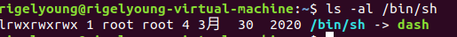
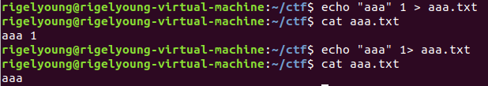
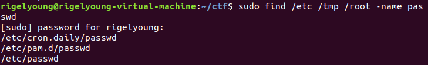
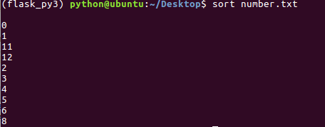
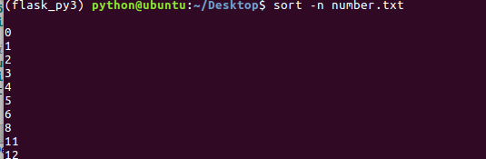

# shell

## shell简介

在计算机科学中，Shell俗称壳（用来区别于核），是指“为使用者提供操作界面”的软件（命令解析器）。它类似于[DOS](https://baike.baidu.com/item/DOS)下的command.com和后来的cmd.exe。它接收用户命令，然后调用相应的应用程序。

**基本上shell分两大类：**

**一：图形界面shell（Graphical User Interface shell 即 GUI shell）**

例如：应用最为广泛的 Windows Explorer （微软的windows系列操作系统），还有也包括广为人知的 Linux shell，其中[linux](https://baike.baidu.com/item/linux) shell 包括 X window manager (BlackBox和FluxBox），以及功能更强大的CDE、GNOME、KDE、 XFCE。

**二：命令行式shell（Command Line Interface shell ，即CLI shell）**

例如：

bash / sh / ksh / csh / zsh（Unix/linux 系统）

（[MS-DOS](https://baike.baidu.com/item/MS-DOS)系统）

[cmd.exe](https://baike.baidu.com/item/cmd.exe)/ 命令提示字符（[Windows NT](https://baike.baidu.com/item/Windows NT) 系统）

Windows PowerShell（支持 .NET Framework 技术的 Windows NT 系统）

传统意义上的shell指的是命令行式的shell，以后如果不特别注明，shell是指命令行式的shell。


shell提供了你与操作系统之间通讯的方式。这种通讯可以以交互方式（从键盘输入，并且可以立即得到响应），或者以shell script(非交互）方式执行。shell script是放在文件中的一串shell和操作系统命令，它们可以被重复使用。本质上，shell script是命令行命令简单的组合到一个文件里面。

Shell基本上是一个命令[解释器](https://baike.baidu.com/item/解释器)，类似于[DOS](https://baike.baidu.com/item/DOS)下的command。它接收用户命令（如ls等），然后调用相应的应用程序。较为通用的shell有标准的Bourne shell (sh）和C shell (csh）。


## shell脚本

在进行linux测试时编写脚本是必不可少的。太频繁地敲击键盘有些累了，可以写Shell脚本。可以把很多的命令写成一个脚本，这样每次执行一遍 shell文件，就可以省去了敲击键盘的时间。

**Shell不仅仅是命令的收集，而且是一门非常棒的编程语言**。您可以通过使用shell使大量的任务自动化，shell特别擅长系统管理任务，尤其适合那些易用性、可维护性和便携性比效率更重要的任务。

用户可以使用任何文本编辑器编辑shell脚本文件，例如VI、gedit等。

Shell脚本的名称可以随便定义，也不要什么后缀名，例如可以写abc，smartzip这类名称。 因为linux不通过后缀来识别文件。

**下面我们开始编写一个Shell脚本：**

**1. 程序必须以下面的行开始（必须放在文件的第一行）：**

```shell
#!/bin/sh
```

和python一样，符号#!用来告诉系统它后面的参数是用来执行该文件的程序。在这个例子中我们使用/bin/sh来执行程序。



**ubuntu中的/bin/sh是dash的软链接**。

**2. 注释**

在进行shell编程时，以#开头的句子表示注释，直到这一行的结束。如同其他编程语言一样，我们在编写脚本时也应该尽可能地添加注释，那么即使相当长的时间内没有使用该脚本，我们也能在很短的时间内明白该脚本的作用及工作原理。

**3. 变量**

在其他编程语言中您必须使用变量。**在shell编程中，所有的变量都由字符串组成，并且您不需要对变量进行声明。**要赋值给一个变量，您可以这样写：变量名=值

**取出变量值可以加一个美元符号（$）在变量前面**：

```shell
#!/bin/sh
#对变量赋值：
a="hello world"
# 现在打印变量a的内容：
echo "A is:"
echo $a
```

**4. Shell命令和流程控制**

在shell脚本中可以使用三类命令：

**1)Unix 命令:**

虽然在shell脚本中可以使用任意的unix命令，但是还是由一些相对更常用的命令。这些命令通常是用来进行文件和文字操作的。

常用命令语法及功能

- echo "some text": 将文字内容打印在屏幕上
- ls: 文件列表
- wc –l filewc -w filewc -c file:
- 计算文件行数计算文件中的单词数计算文件中的字符数
- cp sourcefile destfile: 文件拷贝
- mv oldname newname : 重命名文件或移动文件
- rm file: 删除文件
- grep ''pattern'' file: 在文件内搜索字符串比如：grep
- ''searchstring'' file.txt
- cut -b colnum file:指定欲显示的文件内容范围，并将它们输出到标准输出设备比如：输出每行第5个到第9个字符cut -b5-9 file.txt千万不要和cat命令混淆，这是两个完全不同的命令
- cat file.txt: 输出文件内容到标准输出设备（屏幕）上
- file somefile: 得到文件类型
- read var: 提示用户输入，并将输入赋值给变量
- sort file.txt: 对file.txt文件中的行进行排序
- uniq: 删除文本文件中出现的行列比如： sort file.txt | uniq
- expr: 进行数学运算Example: add 2 and 3expr 2 "+" 3
- find: 搜索文件比如：根据文件名搜索find . -name filename -print
- tee: 将数据输出到标准输出设备(屏幕) 和文件比如：somecommand | tee outfile
- basename file: 返回不包含路径的文件名比如： basename /bin/tux将返回 tux
- dirname file: 返回文件所在路径比如：dirname /bin/tux将返回/bin
- head file: 打印文本文件开头几行
- tail file : 打印文本文件末尾几行


**2) 概念: 管道, 重定向和 backtick**

这些不是系统命令，但是他们真的很重要。管道 (|) 将一个命令的输出作为另外一个命令的输入。

```
grep "hello" file.txt | wc -l
```

在file.txt中搜索包含有”hello”的行并计算其行数。

在这里grep命令的输出作为wc命令的输入。当然您可以使用多个命令。


重定向：将命令的结果输出到文件，而不是标准输出（屏幕）。 **如果文件不存在，则自动生成文件。**

**> 写入文件并覆盖旧文件**

**\>>加到文件的尾部，保留旧文件内容。**


反引号\` `

​     shell中使用反引号进行命令的替换，**命令替换使shell可以将命令字符替换为命令执行结果的输出内容。相当于使用$()的功能**

```kotlin
[root@localhost ~]#echo "Today is `date +%D`"
Today is 01/18/14
[root@localhost ~]#echo “Today is $(date +%D)”
Today is 01/18/14
```


反斜线\

​     反斜线的应用场景有：

​     a）形成转义字符

​     例如*在shell中代表任意字符，是有特殊的含义的。如果想要*在shell命令中表示*字符本身的话，就可以用\*的形式来表示*

​     b）换行续写命令

​     当在命令的末尾使用\+回车键后，\可以将回车的命令提交功能屏蔽，从而将回车认为是换行继续输入的命令，实现命令的多行输入的功能。


3.单引号' '

​     单引号可以将它中间的任意的字符还原为本身的字面意义，实现屏蔽shell元字符的功能。注意，不可以在两个单引号中间单独插入一个单引号，单引号必须成对出现。例如

```ruby
[root@localhost ~]#echo '$HOME'
$HOME
[root@localhost ~]#echo 'test\'
test\
```

 

4.双引号" "
     双引号类似于单引号，但其不会屏蔽反引号，反斜线和$这三个shell元字符的含义，如果需要屏蔽这三个字符含义，必须前置一个\符号。


**3) 流程控制**

"if" 表达式 如果条件为真则执行then后面的部分：

>  if ....; then
> ....
> elif ....; then
> ....
>  else
>  ....
>  fi

大多数情况下，可以使用测试命令来对条件进行测试。比如可以比较字符串、判断文件是否存在及是否可读等等…通常用" [ ] "来表示条件测试。注意这里的空格很重要。要确保方括号的空格。

-  [ -f "somefile" ] ：判断是否是一个文件
-  [ -x "/bin/ls" ] ：判断/bin/ls是否存在并有可执行权限
-  [ -n "$var" ] ：判断$var变量是否有值
-  [ "$a" = "$b" ] ：判断$a和$b是否相等


5.执行脚本 Linux下的sh文件默认是有执行权限的。我们可以用命令：`ls -l file_name`来查看用户对文件的权限。如果没有执行权限，可以执行以下命令添加：`chmod +x file_name `。然后可以通过运行：sh XX.sh这样的命令来运行脚本。当然不同的系统可能不完全相同，需要根据实际情况来。例如有的Linux下是./XX.sh就可以运行。

概括地来说，shell对shell脚本的调用可以采用方式：

```
$ Bash script_file
```

```
$./script_file
```


### if语句

语法格式为：

```shell
if condition
then
  statement(s)
fi
```

`condition`是判断条件，如果 condition 成立（返回“真”），那么 then 后边的语句将会被执行；如果 condition 不成立（返回“假”），那么不会执行任何语句。

> 从本质上讲，if 检测的是命令的退出状态，我们将在下节《[Shell退出状态](http://c.biancheng.net/view/2735.html)》中深入讲解。

注意，最后必须以`fi`来闭合，fi 就是 if 倒过来拼写。也正是有了 fi 来结尾，所以即使有多条语句也不需要用`{ }`包围起来。

如果你喜欢，也可以将 then 和 if 写在一行：

```shell
if condition;  then
  statement(s)
fi
```

请注意 condition 后边的分号`;`，当 if 和 then 位于同一行的时候，这个分号是必须的，否则会有语法错误。

#### 实例1

下面的例子使用 if 语句来比较两个数字的大小：

```shell
#!/bin/bash
read a
read b
if (( $a == $b ))
then   
echo "a和b相等"
fi
```

运行结果：
84↙
84↙
a和b相等

`(())`是一种数学计算命令，它除了可以进行最基本的加减乘除运算，还可以进行大于、小于、等于等关系运算，以及与、或、非逻辑运算。当 a 和 b 相等时，`(( $a == $b ))`判断条件成立，进入 if，执行 then 后边的 echo 语句。

### if else 语句

如果有两个分支，就可以使用 if else 语句，它的格式为：

```
if condition
then
  statement1
else
  statement2
fi
```

如果 condition 成立，那么 then 后边的 statement1 语句将会被执行；否则，执行 else 后边的 statement2 语句。

举个例子：

```shell
#!/bin/bash
read a
read b
if (( $a == $b ))
then
    echo "a和b相等"
else
    echo "a和b不相等，输入错误"
fi
```

## if elif else 语句

Shell 支持任意数目的分支，当分支比较多时，可以使用 if elif else 结构，它的格式为：

```
if  condition1
then
   statement1
elif condition2
then
    statement2
elif condition3
then
    statement3
……
else
   statementn
fi
```

注意，if 和 elif 后边都得跟着 then。

整条语句的执行逻辑为：

- 如果 condition1 成立，那么就执行 if 后边的 statement1；如果 condition1 不成立，那么继续执行 elif，判断 condition2。
- 如果 condition2 成立，那么就执行 statement2；如果 condition2 不成立，那么继续执行后边的 elif，判断 condition3。
- 如果 condition3 成立，那么就执行 statement3；如果 condition3 不成立，那么继续执行后边的 elif。
- 如果所有的 if 和 elif 判断都不成立，就进入最后的 else，执行 statementn。


举个例子，输入年龄，输出对应的人生阶段：

```shell
#!/bin/bash
read age
if (( $age <= 2 )); then
    echo "婴儿"
elif (( $age >= 3 && $age <= 8 )); then
    echo "幼儿"
elif (( $age >= 9 && $age <= 17 )); then
    echo "少年"
elif (( $age >= 18 && $age <=25 )); then
    echo "成年"
elif (( $age >= 26 && $age <= 40 )); then
    echo "青年"
elif (( $age >= 41 && $age <= 60 )); then
    echo "中年"
else
    echo "老年"
fi
```

运行结果1：
19
成年

运行结果2：
100
老年


### 基本运算符

原生bash不支持简单的数学运算，但是可以通过其他命令来实现，例如 awk 和 expr，expr 最常用。

expr 是一款表达式计算工具，使用它能完成表达式的求值操作。

例如，两个数相加(**注意使用的是反引号 \**`\** 而不是单引号 \**'\****)：

##### 示例

```shell
#!/bin/bash

val=`expr 2 + 2`
echo "两数之和为 : $val"
```

结果：

```
两数之和为 : 4
```

expr是一条命令，将字符串解释为数学运算，用``括起来，结果赋给val。     变量均为字符串类型

两点注意：

- **表达式和运算符之间要有空格，例如 2+2 是不对的，必须写成 2 + 2**，这与我们熟悉的大多数编程语言不一样。  ~~说明bash的解释器功能不太行，很简单~~
- 完整的表达式要被``包含，注意这个字符不是常用的单引号，在 Esc 键下边。

#### 算术运算符

下表列出了常用的算术运算符，假定变量 a 为 10，变量 b 为 20：

| 运算符 | 说明                                          | 举例                          |
| :----- | :-------------------------------------------- | :---------------------------- |
| +      | 加法                                          | `expr $a + $b` 结果为 30。    |
| -      | 减法                                          | `expr $a - $b` 结果为 -10。   |
| *      | 乘法                                          | `expr $a \* $b` 结果为  200。 |
| /      | 除法                                          | `expr $b / $a` 结果为 2。     |
| %      | 取余                                          | `expr $b % $a` 结果为 0。     |
| =      | 赋值                                          | a=$b 将把变量 b 的值赋给 a。  |
| ==     | 相等。用于比较两个数字，相同则返回 true。     | [ $a == $b ] 返回 false。     |
| !=     | 不相等。用于比较两个数字，不相同则返回 true。 | [ $a != $b ] 返回 true。      |

**注意：**条件表达式要放在方括号之间，并且要有空格，例如: **[$a==$b]** 是错误的，必须写成 **[ $a == $b ]**。

##### 示例

```shell
#!/bin/bash
# author:菜鸟教程
# url:www.runoob.com

a=10
b=20

val=`expr $a + $b`
echo "a + b : $val"

val=`expr $a - $b`
echo "a - b : $val"

val=`expr $a \* $b`
echo "a * b : $val"

val=`expr $b / $a`
echo "b / a : $val"

val=`expr $b % $a`
echo "b % a : $val"

if [ $a == $b ]
then
   echo "a 等于 b"
fi
if [ $a != $b ]
then
   echo "a 不等于 b"
fi
```

结果：

```shell
a + b : 30
a - b : -10
a * b : 200
b / a : 2
b % a : 0
a 不等于 b
```

>**注意：**
>
>- 乘号(*)前边必须加反斜杠(\)才能实现乘法运算；   **因为\*在shell中是通配符！**
>- 在 MAC 中 shell 的 expr 语法是：**$((表达式))**，此处表达式中的 "*" 不需要转义符号 "\" 。

## 关系运算符

**关系运算符只支持数字，不支持字符串，除非字符串的值是数字。**

下表列出了常用的关系运算符，假定变量 a 为 10，变量 b 为 20：

| 运算符 | 说明                                                  | 举例                       |
| :----- | :---------------------------------------------------- | :------------------------- |
| -eq    | 检测两个数是否相等，相等返回 true。                   | [ $a -eq $b ] 返回 false。 |
| -ne    | 检测两个数是否不相等，不相等返回 true。               | [ $a -ne $b ] 返回 true。  |
| -gt    | 检测左边的数是否大于右边的，如果是，则返回 true。     | [ $a -gt $b ] 返回 false。 |
| -lt    | 检测左边的数是否小于右边的，如果是，则返回 true。     | [ $a -lt $b ] 返回 true。  |
| -ge    | 检测左边的数是否大于等于右边的，如果是，则返回 true。 | [ $a -ge $b ] 返回 false。 |
| -le    | 检测左边的数是否小于等于右边的，如果是，则返回 true。 | [ $a -le $b ] 返回 true。  |

##### 示例

```shell
#!/bin/bash
# author:菜鸟教程
# url:www.runoob.com

a=10
b=20

if [ $a -eq $b ]
then
   echo "$a -eq $b : a 等于 b"
else
   echo "$a -eq $b: a 不等于 b"
fi
if [ $a -ne $b ]
then
   echo "$a -ne $b: a 不等于 b"
else
   echo "$a -ne $b : a 等于 b"
fi
if [ $a -gt $b ]
then
   echo "$a -gt $b: a 大于 b"
else
   echo "$a -gt $b: a 不大于 b"
fi
if [ $a -lt $b ]
then
   echo "$a -lt $b: a 小于 b"
else
   echo "$a -lt $b: a 不小于 b"
fi
if [ $a -ge $b ]
then
   echo "$a -ge $b: a 大于或等于 b"
else
   echo "$a -ge $b: a 小于 b"
fi
if [ $a -le $b ]
then
   echo "$a -le $b: a 小于或等于 b"
else
   echo "$a -le $b: a 大于 b"
fi
```

结果：

```
10 -eq 20: a 不等于 b
10 -ne 20: a 不等于 b
10 -gt 20: a 不大于 b
10 -lt 20: a 小于 b
10 -ge 20: a 小于 b
10 -le 20: a 小于或等于 b
```

## 布尔运算符

下表列出了常用的布尔运算符，假定变量 a 为 10，变量 b 为 20：

| 运算符 | 说明                                                | 举例                                     |
| :----- | :-------------------------------------------------- | :--------------------------------------- |
| !      | 非运算，表达式为 true 则返回 false，否则返回 true。 | [ ! false ] 返回 true。                  |
| -o     | 或运算，有一个表达式为 true 则返回 true。           | [ $a -lt 20 -o $b -gt 100 ] 返回 true。  |
| -a     | 与运算，两个表达式都为 true 才返回 true。           | [ $a -lt 20 -a $b -gt 100 ] 返回 false。 |

## 逻辑运算符

以下介绍 Shell 的逻辑运算符，假定变量 a 为 10，变量 b 为 20:

| 运算符 | 说明       | 举例                                       |
| :----- | :--------- | :----------------------------------------- |
| &&     | 逻辑的 AND | [[ $a -lt 100 && $b -gt 100 ]] 返回 false  |
| \|\|   | 逻辑的 OR  | [[ $a -lt 100 \|\| $b -gt 100 ]] 返回 true |

## 字符串运算符

下表列出了常用的字符串运算符，假定变量 a 为 "abc"，变量 b 为 "efg"：

| 运算符 | 说明                                         | 举例                     |
| :----- | :------------------------------------------- | :----------------------- |
| =      | 检测两个字符串是否相等，相等返回 true。      | [ $a = $b ] 返回 false。 |
| !=     | 检测两个字符串是否相等，不相等返回 true。    | [ $a != $b ] 返回 true。 |
| -z     | 检测字符串长度是否为0，为0返回 true。        | [ -z $a ] 返回 false。   |
| -n     | 检测字符串长度是否不为 0，不为 0 返回 true。 | [ -n "$a" ] 返回 true。  |
| $      | 检测字符串是否为空，不为空返回 true。        | [ $a ] 返回 true。       |

## 文件测试运算符

文件测试运算符用于检测 Unix 文件的各种属性。

属性检测描述如下：

| 操作符  | 说明                                                         | 举例                      |
| :------ | :----------------------------------------------------------- | :------------------------ |
| -b file | 检测文件是否是块设备文件，如果是，则返回 true。              | [ -b $file ] 返回 false。 |
| -c file | 检测文件是否是字符设备文件，如果是，则返回 true。            | [ -c $file ] 返回 false。 |
| -d file | 检测文件是否是目录，如果是，则返回 true。                    | [ -d $file ] 返回 false。 |
| -f file | 检测文件是否是普通文件（既不是目录，也不是设备文件），如果是，则返回 true。 | [ -f $file ] 返回 true。  |
| -g file | 检测文件是否设置了 SGID 位，如果是，则返回 true。            | [ -g $file ] 返回 false。 |
| -k file | 检测文件是否设置了粘着位(Sticky Bit)，如果是，则返回 true。  | [ -k $file ] 返回 false。 |
| -p file | 检测文件是否是有名管道，如果是，则返回 true。                | [ -p $file ] 返回 false。 |
| -u file | 检测文件是否设置了 SUID 位，如果是，则返回 true。            | [ -u $file ] 返回 false。 |
| -r file | 检测文件是否可读，如果是，则返回 true。                      | [ -r $file ] 返回 true。  |
| -w file | 检测文件是否可写，如果是，则返回 true。                      | [ -w $file ] 返回 true。  |
| -x file | 检测文件是否可执行，如果是，则返回 true。                    | [ -x $file ] 返回 true。  |
| -s file | 检测文件是否为空（文件大小是否大于0），不为空返回 true。     | [ -s $file ] 返回 true。  |
| -e file | 检测文件（包括目录）是否存在，如果是，则返回 true。          | [ -e $file ] 返回 true。  |

其他检查符：

- **-S**: 判断某文件是否 socket。
- **-L**: 检测文件是否存在并且是一个符号链接。


### shell脚本中的特殊变量

​	环境变量的使用和普通变量一样，能直接用。$来取值

| $0   | 当前脚本的文件名                                             |
| ---- | ------------------------------------------------------------ |
| $n   | 传递给脚本或函数的参数。n 是一个数字，表示第几个参数。例如，第一个参数是$1，第二个参数是$2。 |
| $#   | 传递给脚本或函数的参数个数                                   |
| $*   | 传递给脚本或函数的所有参数                                   |
| $@   | 传递给脚本或函数的所有参数。被双引号(" ")包含时，与 $* 稍有不同，下面将会讲到 |
| $?   | 上个命令的退出状态，或函数的返回值                           |
| $-   | 显示Shell使用的当前选项,参看[set命令](https://www.runoob.com/linux/linux-comm-set.html) |
| $$   | 当前Shell进程ID。对于 Shell 脚本，就是这些脚本所在的进程ID   |
| $!   | 后台运行的最后一个进程的ID号                                 |

### 1、$n

功能描述：n为数字，$0代表该脚本名称，包含完整路径。$1-9 代 表 第 一 到 第 九 个 参 数 ， 十 以 上 的 参 数 需 要 用 大 括 号 包 含 ， 如 9代表第一到第九个参数，十以上的参数需要用大括号包含，如9代表第一到第九个参数，十以上的参数需要用大括号包含，如{10}             **在最前面的sh在shell脚本中是不被算在参数内的，所以$0是脚本文件名**

范例：输出该脚本文件名称，输入参数1和输入参数2的值

![[外链图片转存失败,源站可能有防盗链机制,建议将图片保存下来直接上传(img-FKY6whpa-1582378829917)(C:\Users\016322605\Desktop\csdn\shell\捕获22.PNG)]](shell.assets/20200222214045575.PNG)

![[外链图片转存失败,源站可能有防盗链机制,建议将图片保存下来直接上传(img-RnVe8KKZ-1582378829918)(C:\Users\016322605\Desktop\csdn\shell\捕获23.PNG)]](shell.assets/20200222214056290.PNG)

### 2、$#

功能描述：获取所有输入参数个数，常用于循环。

范例：获取输入参数的个数

![[外链图片转存失败,源站可能有防盗链机制,建议将图片保存下来直接上传(img-dJdhJM5v-1582378829918)(C:\Users\016322605\Desktop\csdn\shell\捕获24.PNG)]](shell.assets/2020022221410643.PNG)

![[外链图片转存失败,源站可能有防盗链机制,建议将图片保存下来直接上传(img-jDzVeW3b-1582378829919)(C:\Users\016322605\Desktop\csdn\shell\捕获25.PNG)]](shell.assets/20200222214115320.PNG)

### 3、`$*`和`$@`

`$*` :这个变量代表命令行中所有的参数，$*把所有的参数看成一个整体

`$@` :这个变量也代表命令行中所有的参数，不过$@把每个参数区分对待

范例：打印输出所有参数

![[外链图片转存失败,源站可能有防盗链机制,建议将图片保存下来直接上传(img-yTwKorw7-1582378829920)(C:\Users\016322605\Desktop\csdn\shell\捕获26.PNG)]](shell.assets/20200222214125721.PNG)

![[外链图片转存失败,源站可能有防盗链机制,建议将图片保存下来直接上传(img-lrN4OGBV-1582378829920)(C:\Users\016322605\Desktop\csdn\shell\捕获27.PNG)]](shell.assets/20200222214135305.PNG)

### 4、$?

功能描述：最后一次执行的命令的返回状态(exit status)。**如果这个变量的值为0，证明上一个命令正确执行；如果这个变量的值为非0（具体哪个数，由命令自己来决定），则证明上一个命令执行不正确了。**

![[外链图片转存失败,源站可能有防盗链机制,建议将图片保存下来直接上传(img-SqnUHxI3-1582378829921)(C:\Users\016322605\Desktop\csdn\shell\捕获28.PNG)]](shell.assets/20200222214143230.PNG)


## 通配符

因为 shell 频繁 地使用文件名，shell 提供了特殊字符来帮助你快速指定一组文件名。这些特殊字符叫做通配符。

shell常见的通配符，注意与正则稍有不同：

| 字符                  | 含义                                     | 实例                                                         |
| --------------------- | ---------------------------------------- | ------------------------------------------------------------ |
| *                     | 匹配0个或多个任意字符                    | a*b，**a与b之间可以有任意长度的字符，也可以没有**。例如：aabcb，ab，azxcb... |
| ?                     | 匹配一个任意字符                         | a?b，a与b之间必须但也只能存在一个字符，该字符可以是任意字符。例如：aab，abb，acb...     一个？代表一个字符，可以同时使用多个？ |
| [list]                | 匹配list中的任意单个字符                 | a[xyz]b，a与b之间**必须但也只能存在一个字符，该字符只能是x或y或z**。例如：axb，ayb，azb |
| [!list]或\[^list]     | 匹配**除**list中的任意单个字符           | a[!a-z]b，a与b之间必须但也只能存在一个字符，该字符不能是小写字母(例子中的)。例如：aAb，a0b... |
| [c1-c2]               | 匹配c1-c2间的任意单个字符                | a[0-1]b，a与b之间必须但也只能存在一个字符。例如：a0b，a1b... |
| {string1,string2,...} | 匹配string1、string2等中的**一个字符串** | a{abc,xyz,opq}b，a与b之间**必须但也只能存在一个字符串**，字符串只能是abc或xyz或opq。例如：aabcb，axyzb，aopqb... |

备注：几种常见特殊的符号表示（**表示一个字符**）：

> ```
>  [[:upper:]]：所有大写字母
>  [[:lower:]]：所有小写字母
>  [[:alpha:]]：所有字母
>  [[:digit:]]：所有数字
>  [[:alnum:]]：所有的字母和数字
>  [[:space:]]：所有空白字符
>  [[:punct:]]：所有标点符号
> ```

#### 实例

```
[root@youxi1 ~]# ls /etc/*.conf
/etc/asound.conf  /etc/kdump.conf      /etc/man_db.conf    /etc/sudo-ldap.conf
/etc/chrony.conf  /etc/krb5.conf       /etc/mke2fs.conf    /etc/sysctl.conf
/etc/dracut.conf  /etc/ld.so.conf      /etc/nsswitch.conf  /etc/vconsole.conf
/etc/e2fsck.conf  /etc/libaudit.conf   /etc/resolv.conf    /etc/yum.conf
/etc/fuse.conf    /etc/libuser.conf    /etc/rsyslog.conf
/etc/GeoIP.conf   /etc/locale.conf     /etc/sestatus.conf
/etc/host.conf    /etc/logrotate.conf  /etc/sudo.conf
[root@youxi1 ~]# ls /etc/???.conf
/etc/yum.conf
[root@youxi1 ~]# touch file{1,2,3}
[root@youxi1 ~]# ls file*
file1  file2  file3
[root@youxi1 ~]# ls file[123]
file1  file2  file3
```

注意一下，结果会输出所有符合要求的文件。说明通配符只是说明自己的需求，并不是只取某一个文件。  

​	**特别注意touch，会生成所有情况的文件名。  但是只是{}有用，touch file[123]就只生成文件名为file[123]的文件**


​          形式                             匹配项

​          g*                   以g开头的任意文件

​         b*.txt                  以b开头，中间有任意多个字符，并以.txt结尾的任意一个文件

​         Data???                以Data 开头，后面跟3个字符的任意一个文件

​         [abc]                  以abc 中的任意一个开头的任意一个文件

  BACKUP.[0-9][0-9][0-9]          以BACKUP.开头，后面跟3个数字的任意一个文件

​      [[ :upper: ]]*                以大写字母开头的任意一个文件

​      [![ :digit: ]]*                不以数字开头的任意一个文件


## 重定向

大多数 UNIX 系统命令从你的终端接受输入并将所产生的输出发送回到您的终端。一个命令通常从一个叫标准输入的地方读取输入，默认情况下，这恰好是你的终端。同样，一个命令通常将其输出写入到标准输出，默认情况下，这也是你的终端。

重定向命令列表如下：

| 命令            | 说明                                               |
| :-------------- | :------------------------------------------------- |
| command > file  | 将**输出**重定向到 file。                          |
| command < file  | 将**输入**重定向到 file。                          |
| command >> file | 将输出以追加的方式重定向到 file。                  |
| n > file        | 将文件描述符为 n 的文件重定向到 file。             |
| n >> file       | 将文件描述符为 n 的文件以追加的方式重定向到 file。 |
| n >& m          | 将输出文件 m 和 n 合并。 n的输出通过m来表现        |
| n <& m          | 将输入文件 m 和 n 合并。                           |
| << tag          | 将开始标记 tag 和结束标记 tag 之间的内容作为输入。 |

> 需要注意的是文件描述符 0 通常是标准输入（STDIN），1 是标准输出（STDOUT），2 是标准错误输出（STDERR）。

**>是重定向符，就是把前面输出的内容重定向到后面指定的位置**

**`echo` `"一些内容"` `> filename.txt`**

**>前是可以加数字来说明把什么内容重定向到文件中，默认是把标准输出重定向到文件中**，所以下面这个例子和上面那个是一样的（例2）：

 **`echo` `"一些内容"` `1> filename.txt`**


**& 是一个描述符，如果1或2前不加&，会被当成一个普通文件。**

**1>&2 意思是把标准输出重定向到标准错误.**

**2>&1 意思是把标准错误输出重定向到标准输出。**

**&>filename 意思是把标准输出和标准错误输出都重定向到文件filename中**（除了这种情况，&一般都是在>后的，用于区别普通文件。    在>前，0 1 2都是可直接表示stdin/out/err，但是和>之间不能有空格！  不然会被当成前面指令的参数   见下图）




##### 输出重定向

执行下面的 who 命令，它将命令的完整的输出重定向在用户文件中(users):

```
$ who > users
```

执行后，并没有在终端输出信息，这是因为输出已被从默认的标准输出设备（终端）重定向到指定的文件。

你可以使用 cat 命令查看文件内容：

```
$ cat users
_mbsetupuser console  Oct 31 17:35 
tianqixin    console  Oct 31 17:35 
tianqixin    ttys000  Dec  1 11:33 
```

>Linux who命令用于显示系统中有哪些使用者正在上面，显示的资料包含了使用者 ID、使用的终端机、从哪边连上来的、上线时间、呆滞时间、CPU 使用量、动作等等。
>
>使用权限：所有使用者都可使用。

输出重定向会覆盖文件内容，请看下面的例子：

```
$ echo "菜鸟教程：www.runoob.com" > users
$ cat users
菜鸟教程：www.runoob.com
$
```

如果不希望文件内容被覆盖，可以使用 >> 追加到文件末尾，例如：

```
$ echo "菜鸟教程：www.runoob.com" >> users
$ cat users
菜鸟教程：www.runoob.com
菜鸟教程：www.runoob.com
$
```

#### 输入重定向

接着以上实例，我们需要统计 users 文件的行数,执行以下命令：

```
$ wc -l users
       2 users
```

也可以将输入重定向到 users 文件：

```
$  wc -l < users
       2 
```

注意：上面两个例子的结果不同：第一个例子，会输出文件名；第二个不会，因为它仅仅知道从标准输入读取内容。

```
command1 < infile > outfile
```

同时替换输入和输出，执行command1，从文件infile读取内容，然后将输出写入到outfile中。

### 重定向深入讲解

一般情况下，每个 Unix/Linux 命令运行时都会打开三个文件：

- 标准输入文件(stdin)：stdin的文件描述符为0，Unix程序默认从stdin读取数据。
- 标准输出文件(stdout)：stdout 的文件描述符为1，Unix程序默认向stdout输出数据。
- 标准错误文件(stderr)：stderr的文件描述符为2，Unix程序会向stderr流中写入错误信息。

默认情况下，command > file 将 stdout 重定向到 file，command < file 将stdin 重定向到 file。

如果希望 stderr 重定向到 file，可以这样写：

```
$ command 2> file
```

如果希望 stderr 追加到 file 文件末尾，可以这样写：

```
$ command 2>> file
```

**2** 表示标准错误文件(stderr)。

如果希望将 stdout 和 stderr 合并后重定向到 file，可以这样写：

```
$ command > file 2>&1
或者
$ command >> file 2>&1
```

如果希望对 stdin 和 stdout 都重定向，可以这样写：

```
$ command < file1 >file2
```

command 命令将 stdin 重定向到 file1，将 stdout 重定向到 file2。

## /dev/null 文件

如果希望执行某个命令，但又不希望在屏幕上显示输出结果，那么可以将输出重定向到 /dev/null：

```
$ command > /dev/null
```

/dev/null 是一个特殊的文件，写入到它的内容都会被丢弃；如果尝试从该文件读取内容，那么什么也读不到。但是 /dev/null 文件非常有用，将命令的输出重定向到它，会起到"禁止输出"的效果。

如果希望屏蔽 stdout 和 stderr，可以这样写：

```
$ command > /dev/null 2>&1
```

 **注意：**0 是标准输入（STDIN），1 是标准输出（STDOUT），2 是标准错误输出（STDERR）。

**这里的 2 和 >之间不可以有空格，2>是一体的时候才表示错误输出。**


## 管道

通过前面的学习，我们已经知道了怎样从文件重定向输入，以及重定向输出到文件。Shell 还有一种功能，就是可以将两个或者多个命令（程序或者进程）连接到一起，把一个命令的输出作为下一个命令的输入，以这种方式连接的两个或者多个命令就形成了**管道（pipe）**。

Linux 管道使用竖线`|`连接多个命令，这被称为管道符。Linux 管道的具体语法格式如下：

command1 | command2
command1 | command2 [ | commandN... ]

**当在两个命令之间设置管道时，管道符`|`左边命令的输出就变成了右边命令的输入。只要第一个命令向标准输出写入，而第二个命令是从标准输入读取，那么这两个命令就可以形成一个管道。**大部分的 Linux 命令都可以用来形成管道。

​	例如grep，Linux grep 命令用于查找文件里符合条件的字符串。grep 指令用于查找内容包含指定的范本样式的文件，如果发现某文件的内容符合所指定的范本样式，预设 grep 指令会把含有范本样式的那一列显示出来。**若不指定任何文件名称，或是所给予的文件名为 -，则 grep 指令会从标准输入设备读取数据**（一直循环）


```
grep [-abcEFGhHilLnqrsvVwxy][-A<显示列数>][-B<显示列数>][-C<显示列数>][-d<进行动作>][-e<范本样式>][-f<范本文件>][--help][范本样式][文件或目录...]
```

> 这里需要注意，command1 必须有正确输出，而 command2 必须可以处理 command2 的输出结果；而且 command2 只能处理 command1 的正确输出结果，不能处理 command1 的错误信息。


## 为什么使用管道？

我们先看下面一组命令，使用 mysqldump（一个数据库备份程序）来备份一个叫做 wiki 的数据库：

mysqldump -u root -p '123456' wiki > /tmp/wikidb.backup
gzip -9 /tmp/wikidb.backup
scp /tmp/wikidb.backup username@remote_ip:/backup/mysql/

上述这组命令主要做了如下任务：

- mysqldump 命令用于将名为 wike 的数据库备份到文件 /tmp/wikidb.backup；其中`-u`和`-p`选项分别指出数据库的用户名和密码。
- gzip 命令用于压缩较大的数据库文件以节省磁盘空间；其中`-9`表示最慢的压缩速度最好的压缩效果。
- scp 命令（secure copy，安全拷贝）用于将数据库备份文件复制到 IP 地址为 remote_ip 的备份服务器的 /backup/mysql/ 目录下。其中`username`是登录远程服务器的用户名，命令执行后需要输入密码。


上述三个命令依次执行。然而，如果使用管道的话，你就可以将 mysqldump、gzip、ssh 命令相连接，这样就避免了创建临时文件 /tmp/wikidb.backup，而且可以同时执行这些命令并达到相同的效果。

使用管道后的命令如下所示：

mysqldump -u root -p '123456' wiki | gzip -9 | ssh username@remote_ip "cat > /backup/wikidb.gz"

这些使用了管道的命令有如下特点：

- 命令的语法紧凑并且使用简单。
- 通过使用管道，将三个命令串联到一起就完成了远程 mysql 备份的复杂任务。
- 从管道输出的标准错误会混合到一起（**管道传输的是stdout的内容，不包含srderr**。    这是因为3条指令通过管道连接，形成了1条指令，所以stderr会在一起）。

上述命令的数据流如下图所示：


**gzip为了支持这种用法，可以不指定文件，通过管道来给gzip原文件，这时就是通过标准输入，与grep一样。**


## 重定向和管道的区别

乍看起来，管道也有重定向的作用，它也改变了数据输入输出的方向，那么，管道和重定向之间到底有什么不同呢？

简单地说，重定向操作符>将命令与文件连接起来，用文件来接收命令的输出；而管道符|将命令与命令连接起来，用第二个命令来接收第一个命令的输出。如下所示：

command > file
command1 | command1

有些读者在学习管道时会尝试如下的命令，我们来看一下会发生什么：

command1 > command2

答案是，有时尝试的结果将会很糟糕。这是一个实际的例子，一个 Linux 系统管理员以超级用户（root 用户）的身份执行了如下命令：

cd /usr/bin
ls > less

第一条命令将当前目录切换到了大多数程序所存放的目录，第二条命令是告诉 Shell 用 ls 命令的输出**重写文件 less**。因为 /usr/bin 目录已经包含了名称为 less（less 程序）的文件，第二条命令用 ls 输出的文本重写了 less 程序，因此破坏了文件系统中的 less 程序。

这是使用重定向操作符错误重写文件的一个教训，所以在使用它时要谨慎。

## Linux管道实例

【实例1】将 ls 命令的输出发送到 grep 命令：

```
[c.biancheng.net]$ ls | grep log.txt
log.txt
```

上述命令是查看文件 log.txt 是否存在于当前目录下。

我们可以在命令的后面使用选项，例如使用`-al`选项：

```
[c.biancheng.net]$ ls -al | grep log.txt
-rw-rw-r--.  1 mozhiyan mozhiyan    0 4月  15 17:26 log.txt
```

管道符`|`与两侧的命令之间也可以不存在空格，例如将上述命令写作`ls -al|grep log.txt`；然而我还是推荐在管道符`|`和两侧的命令之间使用空格，以增加代码的可读性。

我们也可以重定向管道的输出到一个文件，比如将上述管道命令的输出结果发送到文件 output.txt 中：

```
[c.biancheng.net]$ ls -al | grep log.txt >output.txt
[c.biancheng.net]$ cat output.txt
-rw-rw-r--.  1 mozhiyan mozhiyan    0 4月  15 17:26 log.txt
```


## 续行符

[Linux](http://lib.csdn.net/base/linux)下命令行的参数可能会很长，特别编译安装程序的时候的configure参数。

如果直接写在一行，书写起来很长，看起来也不美观还容易漏项。

自然就会想到如何将shell的一行命令拆成多行去执行。

shell已经为我们准备好了这个续行符 "\"，来把一行命令分解成多行

shell命令行下反斜线"\"有

两种含义:

1. 对有特殊含义的字符进行转义

   例如 echo "123\$"，结果是123$

2. \Enter,反斜杠后面紧跟回车，表示下一行是当前行的续航。

   ./configure --sbin-path=/usr/local/nginx/nginx \
   --conf-path=/usr/local/nginx/nginx.conf \
   --pid-path=/usr/local/nginx/nginx.pid \
   --with-http_ssl_module \
   --with-pcre=/usr/local/src/pcre-8.21 \
   --with-zlib=/usr/local/src/zlib-1.2.8 \
   --with-openssl=/usr/local/src/openssl-1.0.1c


## find递归查找

Linux find 命令用来在指定目录下查找文件。任何位于参数之前的字符串都将被视为欲查找的目录名。如果使用该命令时，不设置任何参数，则 find 命令将在当前目录下查找子目录与文件。并且将查找到的子目录和文件全部进行显示。

## 1 命令格式：

```xml
$ find <指定目录> <指定条件> <指定动作>
```

最常见示例：查找文件名（忽略大小写）

```java
$find . -iname sqlquery.java
```

### 1.1 <指定目录>：

 所要搜索的**目录及其所有子目录**。默认为当前目录。find默认递归指定目录。**目录可以有多个，目录之间要用空格分开。**         **默认是深度优先遍历**



### 1.2 <指定条件>： 

所要搜索的文件的特征。

**[1]根据文件名查找**
-name   按照文件名查找 
-iname  根据文件名查找，但是不区分大小写
-prune   不在当前指定的目录中查找 
-depth   在查找文件时，首先查找当前目录中的文件，然后再在其子目录中查找    采用**广度优先遍历**算法
**[2]根据文件所属用户和组来查找文件**

-user   按照文件属主来查找文件 

```php
$find / -user fred 		//查找在系统中属于FRED这个用户的文件
```

-group   按照文件所属的组来查找文件  

```php
$find / -group cat 		//查找在系统中属于group组名cat的文件 
```

**[3]根据uid 和 gid来查找用户**

-uid

```cpp
#find  /tmp -uid 500       //查找uid是500 的文件
```

-gid

```cpp
#find  /tmp -gid 1000      // 查找gid是1000的文件
```

**[4]-a,-o,-not的使用**

-a    连接两个不同的条件（两个条件必须同时满足）

```sql
#find /tmp -name "*.sh" -a -user root
```

-o    连接两个不同的条件（两个条件满足其一即可）

```cpp
#find /tmp -name "*.sh" -o -user root
```

-not 对条件取反的

```markdown
#find /tmp -not -user root
```

[5]根据文件时间戳的相关属性来查找文件

-atime  最近一次访问时间    单位：天
-mtime 最近一次内容修改时间  单位：天
-ctime  最近一次属性修改时间  单位：天
-amin  最近一次访问时间    单位：分钟
-mmin 最近一次内容修改时间  单位：分钟
-cmin  最近一次属性修改时间  单位：分钟
-newer file1 ! file2 查找更改时间比文件file1新但比文件file2旧的文件 

```cpp
#find /tmp -atime +5  //表示查找在五天内没有访问过的文件
#find /tmp -atime -5   //表示查找在五天内访问过的文件
```

[6]根据文件类型来查找文件

-type 查找某一类型的文件 
文件类型： 
f 普通文件 
d 目录 
l 符号链接文件 
c 字符设备文件 
p 管道文件 
b 块设备文件
s socket文件

```lua
#find /tmp -type s
```

**[7]根据大小来查找文件**

-size n[c] 查找文件长度为n块的文件，带有c时表示文件长度以字节计 

```cpp
#find /tmp -size  2M           //查找在/tmp 目录下等于2M的文件
#find /tmp -size +2M           //查找在/tmp 目录下大于2M的文件
#find /tmp -size -2M           //查找在/tmp 目录下小于2M的文件
```

```php
$find . -size +1000000c        //在当前目录下查找文件长度大于1 M字节的文件
$find / -empty 		       //查找在系统中为空的文件或者文件夹 
```

**[8]根据文件权限查找文件**

-perm

```cpp
#find /tmp -perm 755           //查找在/tmp目录下权限是755的文件
#find /tmp -perm +222          //表示只要有一类用户（属主，属组，其他）的匹配写权限就行
#find /tmp -perm -222          //表示必须所有类别用户都满足有写权限
```

**[10]-nouser和-nogroup

-nogroup 查找无有效所属组的文件，即该文件所属的组不存在 
-nouser 查找无有效属主的文件 

```sql
#find / -nogroup -a -nouser    //在整个系统中查找既没有属主又没有属组的文件（这样的文件通常是很危险的，作为系统工程师的我们应该及时清除掉）
```

```php
$find / -nouser 	       //查找在系统中属于作废用户的文件 
```

### 1.3 <指定动作>： 

对搜索结果进行特定的处理。

-print       //默认情况下的动作
-ls        //查找到后用ls 显示出来
-ok [commend]   //查找后执行命令的时候询问用户是否要执行
-exec [commend]  //查找后执行命令的时候不询问用户，直接执行

注意-ok和-exec命令将命令行上**后续的参数作为他们参数的一部分，直到被\;序列终止**。魔术字符串{}是-ok和-exec命令的一个特殊类型的参数，它将被当前文件的完整路径取代。

```
#find /tmp -atime +30 –exec rm –rf {} \； //删除查找到的超过30天没有访问过文件
```


## vi基本用法

vi编辑器是所有Unix及Linux系统下标准的编辑器，它的强大不逊色于任何最新的文本编辑器，这里只是简单地介绍一下它的用法和一小部分指令。

1、vi的基本概念
基本上vi可以分为三种状态，分别是命令模式（command mode）、插入模式（Insert mode）和底行模式（last line mode），各模式的功能区分如下：

1) **命令行模式**command mode）

控制屏幕光标的移动，字符、字或行的删除，移动复制某区段及进入Insert mode下，或者到 last line mode。

2) **插入模式**（Insert mode）

只有在Insert mode下，才可以做文字输入，按「ESC」键可回到命令行模式。

3) **底行模式**（last line mode）

将文件保存或退出vi，也可以设置编辑环境，如寻找字符串、列出行号……等。

不过一般我们在使用时把vi简化成两个模式，就是将底行模式（last line mode）也算入命令行模式command mode）。

2、vi的基本操作
a) 进入vi

在系统提示符号输入vi及文件名称后，就进入vi全屏幕编辑画面：

**$ vi myfile**

不过有一点要特别注意，就是您进入vi之后，是处于「命令行模式（command mode）」，您要切换到「插入模式（Insert mode）」才能够输入文字。初次使用vi的人都会想先用上下左右键移动光标，结果电脑一直哔哔叫，把自己气个半死，所以进入vi后，先不要乱动，转换到「插入模式（Insert mode）」再说吧！

b) 切换至插入模式（Insert mode）编辑文件

在「命令行模式（command mode）」下**按一下字母「i」**就可以进入「插入模式（Insert mode）」，这时候你就可以开始输入文字了。

c) Insert 的切换

您目前处于「插入模式（Insert mode）」，您就只能一直输入文字，如果您发现输错了字！想用光标键往回移动，将该字删除，就要**先按一下「ESC」键**转到「命令行模式（command mode）」再删除文字。

d) 退出vi及保存文件

在「命令行模式（command mode）」下**，按一下「：」冒号**键进入「Last line mode」，例如：

: **w filename** （输入 「w filename」将文章以指定的文件名filename保存）

: **wq** (输入「wq」，存盘并退出vi)

: **q!** (输入q!， 不存盘强制退出vi)

也可以直接按大写ZZ，与:wq等效。

3、命令行模式（command mode）功能键
1）. 插入模式

按「i」切换进入插入模式「insert mode」，按“i”进入插入模式后是从光标当前位置开始输入文件；

按「a」进入插入模式后，是从目前光标所在位置的下一个位置开始输入文字；

按「o」进入插入模式后，是插入新的一行，从行首开始输入文字。 （插入的位置是光标的下一行）

2）. 从插入模式切换为命令行模式

按「ESC」键。

3）. 移动光标

vi可以直接用键盘上的光标来上下左右移动，但正规的vi是用小写英文字母「h」、「j」、「k」、「l」，分别控制光标左、下、上、右移一格。

按「ctrl」+「b」：屏幕往“后”移动一页。

按「ctrl」+「f」：屏幕往“前”移动一页。

按「ctrl」+「u」：屏幕往“后”移动半页。

按「ctrl」+「d」：屏幕往“前”移动半页。

按数字「0」：移到文章的开头。

按「G」：移动到文章的最后。

按「$」：移动到光标所在行的“行尾”。

按「^」：移动到光标所在行的“行首”

按「w」：光标跳到下个字的开头

按「e」：光标跳到下个字的字尾

按「b」：光标回到上个字的开头

按「#l」：光标移到该行的第#个位置，如：5l,56l。

4）. 删除文字

「x」：每按一次，删除光标所在位置的“后面”一个字符。

「#x」：例如，「6x」表示删除光标所在位置的“后面”6个字符。

「X」：大写的X，每按一次，删除光标所在位置的“前面”一个字符。

「#X」：例如，「20X」表示删除光标所在位置的“前面”20个字符。

「dd」：删除光标所在行。

「#dd」：从光标所在行开始删除#行

5）. 复制

「yw」：将光标所在之处到字尾的字符复制到缓冲区中。

「#yw」：复制#个字到缓冲区

「yy」：复制光标所在行到缓冲区。

「#yy」：例如，「6yy」表示拷贝从光标所在的该行“往下数”6行文字。

「p」：将缓冲区内的字符贴到光标所在位置。注意：所有与“y”有关的复制命令都必须与“p”配合才能完成复制与粘贴功能。

6）. 替换

「r」：替换光标所在处的字符。

「R」：替换光标所到之处的字符，直到按下「ESC」键为止。

7）. 恢复/撤消/还原上一次操作

「u」：如果误执行一个命令，可以马上按下「u」，撤消上一个操作。按多次“u”可以执行多次撤消。

8）. 更改

「cw」：更改光标所在处的字到字尾处

「c#w」：例如，「c3w」表示更改3个字

9）. 跳至指定的行

「ctrl」+「g」列出光标所在行的行号。

「#G」：例如，「15G」，表示移动光标至文章的第15行行首。

4、Last line mode下命令简介
在使用「last line mode」之前，请记住先按「ESC」键确定您已经处于「command mode」下后，再按「：」冒号即可进入「last line mode」。

A) 列出行号

「set nu」：输入「set nu」后，会在文件中的每一行前面列出行号。

B) 跳到文件中的某一行

「#」：「#」号表示一个数字，在冒号后输入一个数字，再按回车键就会跳到该行了，如输入数字15，再回车，就会跳到文章的第15行。

C) 查找字符

「/关键字」：先按「/」键，再输入您想寻找的字符，如果第一次找的关键字不是您想要的，可以一直按「n」会往后寻找到您要的关键字为止。

「?关键字」：先按「?」键，再输入您想寻找的字符，如果第一次找的关键字不是您想要的，可以一直按「n」会往前寻找到您要的关键字为止。

D) 保存文件

「w」：在冒号输入字母「w」就可以将文件保存起来。

E) 离开vi

「q」：按「q」就是退出，如果无法离开vi，可以在「q」后跟一个「!」强制离开vi。

「qw」：一般建议离开时，搭配「w」一起使用，这样在退出的时候还可以保存文件。

5、vi命令列表
1、下表列出命令模式下的一些键的功能：

h
左移光标一个字符

l
右移光标一个字符

k
光标上移一行

j
光标下移一行

^
光标移动至行首

0
数字“0”，光标移至文章的开头

G
光标移至文章的最后

$
光标移动至行尾

Ctrl+f
向前翻屏

Ctrl+b
向后翻屏

Ctrl+d
向前翻半屏

Ctrl+u
向后翻半屏

i
在光标位置前插入字符

a
在光标所在位置的后一个字符开始增加

o
插入新的一行，从行首开始输入

ESC
从输入状态退至命令状态

x
删除光标后面的字符

\#x
删除光标后的＃个字符

X
(大写X)，删除光标前面的字符

\#X
删除光标前面的#个字符

dd
删除光标所在的行

\#dd
删除从光标所在行数的#行

yw
复制光标所在位置的一个字

\#yw
复制光标所在位置的#个字

yy
复制光标所在位置的一行

\#yy
复制从光标所在行数的#行

p
粘贴

u
取消操作

cw
更改光标所在位置的一个字

\#cw
更改光标所在位置的#个字

下表列出行命令模式下的一些指令
w filename
储存正在编辑的文件为filename

wq filename
储存正在编辑的文件为filename，并退出vi

q!
放弃所有修改，退出vi

set nu
显示行号

/或?
查找，在/后输入要查找的内容

n
与/或?一起使用，如果查找的内容不是想要找的关键字，按n或向后（与/联用）或向前（与?联用）继续查找，直到找到为止。


## grep在文本文件中，查找符合指定模式的文本行

通过grep命令实现

Linux grep 命令用于查找文件里符合条件的字符串。

grep 指令用于查找内容包含指定的范本样式的文件，如果发现某文件的内容符合所指定的范本样式，预设 grep 指令会把含有范本样式的那一列显示出来。若不指定任何文件名称，或是所给予的文件名为 **-**，则 grep 指令会从标准输入设备读取数据。

### 语法

```
grep [-abcEFGhHilLnqrsvVwxy][-A<显示列数>][-B<显示列数>][-C<显示列数>][-d<进行动作>][-e<范本样式>][-f<范本文件>][--help][范本样式][文件或目录...]
```

**参数**：

- **-a 或 --text** : 不要忽略二进制的数据。
- **-A<显示行数> 或 --after-context=<显示行数>** : 除了显示符合范本样式的那一列之外，并显示该行之后的内容。
- **-b 或 --byte-offset** : 在显示符合样式的那一行之前，标示出该行第一个字符的编号。
- **-B<显示行数> 或 --before-context=<显示行数>** : 除了显示符合样式的那一行之外，并显示该行之前的内容。
- **-c 或 --count** : 计算符合样式的列数。
- **-C<显示行数> 或 --context=<显示行数>或-<显示行数>** : 除了显示符合样式的那一行之外，并显示该行之前后的内容。
- **-d <动作> 或 --directories=<动作>** : 当指定要查找的是目录而非文件时，必须使用这项参数，否则grep指令将回报信息并停止动作。
- **-e<范本样式> 或 --regexp=<范本样式>** : 指定字符串做为查找文件内容的样式。
- **-E 或 --extended-regexp** : 将样式为延伸的正则表达式来使用。
- **-f<规则文件> 或 --file=<规则文件>** : 指定规则文件，其内容含有一个或多个规则样式，让grep查找符合规则条件的文件内容，格式为每行一个规则样式。
- **-F 或 --fixed-regexp** : 将样式视为固定字符串的列表。
- **-G 或 --basic-regexp** : 将样式视为普通的表示法来使用。
- **-h 或 --no-filename** : 在显示符合样式的那一行之前，不标示该行所属的文件名称。
- **-H 或 --with-filename** : 在显示符合样式的那一行之前，表示该行所属的文件名称。
- **-i 或 --ignore-case** : 忽略字符大小写的差别。
- **-l 或 --file-with-matches** : 列出文件内容符合指定的样式的文件名称。
- **-L 或 --files-without-match** : 列出文件内容不符合指定的样式的文件名称。
- **-n 或 --line-number** : 在显示符合样式的那一行之前，标示出该行的列数编号。
- **-o 或 --only-matching** : 只显示匹配PATTERN 部分。
- **-q 或 --quiet或--silent** : 不显示任何信息。
- **-r 或 --recursive** : 此参数的效果和指定"-d recurse"参数相同。
- **-s 或 --no-messages** : 不显示错误信息。
- **-v 或 --invert-match** : 显示**不包含匹配文本的所有行**。
- **-V 或 --version** : 显示版本信息。
- **-w 或 --word-regexp** : 只显示全字符合的列。
- **-x --line-regexp** : 只显示全列符合的列。
- **-y** : 此参数的效果和指定"-i"参数相同。

### 实例

1、在当前目录中，查找后缀有 file 字样的文件中包含 test 字符串的文件，并打印出该字符串的行。此时，可以使用如下命令：

```
grep test *file 
```

结果如下所示：

```
$ grep test test* #查找前缀有“test”的文件包含“test”字符串的文件  
testfile1:This a Linux testfile! #列出testfile1 文件中包含test字符的行  
testfile_2:This is a linux testfile! #列出testfile_2 文件中包含test字符的行  
testfile_2:Linux test #列出testfile_2 文件中包含test字符的行 
```

2、以**递归(Recursive)**的方式查找符合条件的文件。例如，**查找指定目录/etc/acpi 及其子目录（如果存在子目录的话）**下所有文件中包含字符串"update"的文件，并打印出该字符串所在行的内容，使用的命令为：

```
grep -r update /etc/acpi 
```

输出结果如下：

```
$ grep -r update /etc/acpi #以递归的方式查找“etc/acpi”  
#下包含“update”的文件  
/etc/acpi/ac.d/85-anacron.sh:# (Things like the slocate updatedb cause a lot of IO.)  
Rather than  
/etc/acpi/resume.d/85-anacron.sh:# (Things like the slocate updatedb cause a lot of  
IO.) Rather than  
/etc/acpi/events/thinkpad-cmos:action=/usr/sbin/thinkpad-keys--update 
```


## sort命令 将文本文件中的各行，按顺序排列 

Linux sort命令用于将文本文件内容加以排序。并**将结果显示在标准输出上**。如不指定输入文件或使用“- ”，则表示排序内容来自标准输入。     **sort并不会修改文件内容，只是把sort之后的结果打印在标准输出中。**

sort可针对文本文件的内容，以行为单位来排序。

### 语法

```
sort [-bcdfimMnr][-o<输出文件>][-t<分隔字符>][+<起始栏位>-<结束栏位>][--help][--verison][文件]
```

**参数说明**：

- -b 忽略每行前面开始出的空格字符。
- -c 检查文件是否已经按照顺序排序。
- -d 排序时，处理英文字母、数字及空格字符外，忽略其他的字符。
- -f 排序时，将小写字母视为大写字母。
- -i 排序时，除了040至176之间的ASCII字符外，忽略其他的字符。
- -m 将几个排序好的文件进行合并。
- -M 将前面3个字母依照月份的缩写进行排序。
- -n **依照数值的大小排序**。
- -u 意味着是唯一的(unique)，输出的结果是去完重了的。
- -o<输出文件> 将排序后的结果存入指定的文件。
- -r **以相反的顺序来排序**。
- -t<分隔字符> 指定排序时所用的栏位分隔字符。
- +<起始栏位>-<结束栏位> 以指定的栏位来排序，范围由起始栏位到结束栏位的前一栏位。
- --help 显示帮助。
- --version 显示版本信息。

### 实例

默认的排序方式是按照ASCII码进行升序



我们可以添加 -n 让它按照数字的大小进行升序



我们可以添加 -n -r 让它按照数字的大小进行降序


## 显示一个文本文件的前几行或者后几行

可以使用head（查看前几行）、tail（查看末尾几行）两个命令。
例如：
查看/etc/profile的前10行内容，应该是：

 head -n 10 /etc/profile
查看/etc/profile的最后5行内容，应该是：
 tail  -n 5 /etc/profile
如果想同时查看可以将前10行和后5行的显示信息通过输出重定向的方法保存到一个文档，这样查看文档即可一目了然。
例如：
将内容输出到/home/test文件中
#head -n 10 /etc/profile >>/home/test
#tail  -n 5 /etc/profile>>/home/test
查看的话只需要打开test文件即可。
cat /home/test


【一】从第3000行开始，显示1000行。即显示3000~3999行

cat filename | tail -n +3000 | head -n 1000

【二】显示1000行到3000行

cat filename| head -n 3000 | tail -n +1000 

