# Anti-Fuzzing

模糊测试作为一种软件测试技术，也可以被恶意攻击者使用以发现零日漏洞。因此，**开发人员希望在其产品上应用反模糊技术以阻止攻击者进行模糊测试，其概念类似于使用混淆技术削弱逆向工程。**

## introduction


所谓的“针对attacker"是指发布的时使用FUZZIFICATION加固过的binary程序，而开发团队可以用普通的binary来fuzz.

在本文中，作者提出了一种**二进制保护的新方向，称为FUZZIFICATION**。攻击者仍然可以从受FUZZIFICATION保护的二进制文件中查找错误，但需要花费更多的精力（例如，CPU，内存和时间）。因此，获得原始二进制文件的开发人员或其他受信任方能够在攻击者之前检测程序错误并合成补丁。


三点要求：

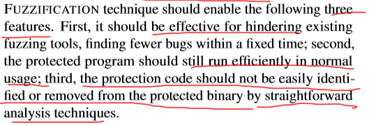

有效的模糊化技术应启用以下三个功能：

- 首先，它应该有效地阻止现有的模糊测试工具，使其在固定时间内发现更少的错误；
- 其次，受保护的程序在正常使用下仍应有效运行；
- 最后，不应被分析技术轻易地识别保护代码或将其从受保护的二进制文件中删除。


现有技术的缺陷：


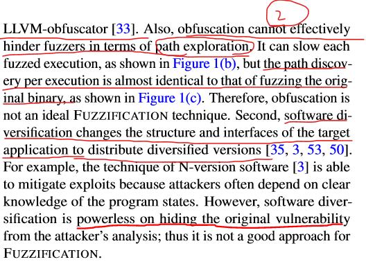

减慢程序执行，无法减少路径覆盖。软件多样性无法阻止原漏洞的分析，只是减小了攻击面，增加了利用难度。

现有技术无法同时实现这三个目标：

- software obfuscation techniques：通过**混淆二进制**表示来**阻止静态程序分析**的软件混淆技术似乎在阻止fuzzing尝试方面很有效。但它有两方面的不足：
  1. 混淆给正常程序执行带来较大的开销，使用Obfuscator-LLVM时则会使执行速度降低25倍。
  2. 混淆处理在路径探索方面不能有效地阻止模糊测试。它可以减慢每个模糊执行的速度，但是每次执行的路径发现几乎与模糊原始二进制文件的路径发现相同。
- **software diversification**：软件多样化能缓解攻击但无法从攻击者分析中隐藏原始漏洞。


#### ollvm

Obfuscator-LLVM就是ollvm混淆。

[Obfuscator-llvm源码分析](https://zhuanlan.zhihu.com/p/39479793)

O-llvm是**基于llvm**进行编写的一个开源项目([https://github.com/obfuscator-llvm/obfuscator](https://link.zhihu.com/?target=https%3A//github.com/obfuscator-llvm/obfuscator))，它的作用是**对前端语言生成的中间代码进行混淆**，目前在市场上，一些加固厂商(比如360加固宝、梆梆加固)会使用改进的O-llvm对它们so文件中的一些关键函数采用O-llvm混淆，增加逆向的难度。因此，掌握O-llvm的实现过程，是很有必要的。O-llvm总体构架和llvm是一致的，如图1所示。

图1 																						LLVM总体架构

其中IR(intermediate representation)是前端语言生成的中间代码表示，也是Pass操作的对象，它主要包含四个部分：

（1）Module：比如一个.c或者.cpp文件。

（2）Function：代表文件中的一个函数。

（3）BasicBlock：每个函数会被划分为一些block，它的划分标准是：一个block只有一个入口和一个出口。

（4）Instruction：具体的指令。

他们之间的关系可用图2表示。

图2 IR中各部分的关系

**Pass1：BogusControlFlow**

BogusControlFlow的功能是为函数增加新的虚假控制流和添加垃圾指令。

**Pass2：Flattening**

Flattening的主要功能是为函数增加switch-case语句，使得函数变得扁平化。

**Pass3：Substitution**

Substitution的主要功能是对程序的一些指令进行替换


##### [控制流扁平化混淆](https://www.cnblogs.com/ichunqiu/p/7383045.html)

>这是《**[软件加密与解密](https://bbs.ichunqiu.com/thread-23674-1-1.html?from=bkyl)**》中的示例代码
>
>```
>int modexp(int y, int x[], int w, int n)
>{
>    int R, L;
>    int k = 0;
>    int s = 1;
>    while(k < w) {
>        if (x[k] == 1) {
>            R = (s * y) % n;
>        }
>        else {
>            R = s;
>        }
>        s = R * R % n;
>        L = R;
>        k++;
>    }
>    return L;
>}
>```
>
>根据上段代码，我们可以画出它的控制流图。
>
>[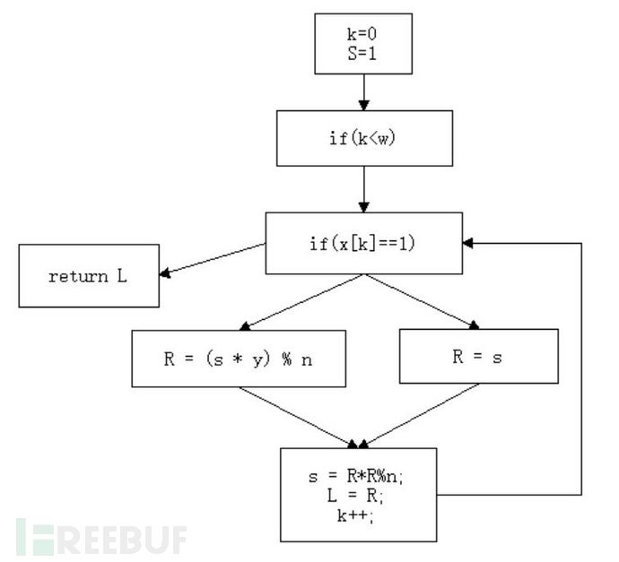](http://image.3001.net/images/20170817/15029498169958.jpg)
>
>这里我们用if来代替while，这样可以使得逻辑更加清晰。这幅图就是扁平前的效果，可以看到程序基本是从上往下执行的，逻辑线路非常明确。
>
>而当我们对它进行了扁平化处理之后，就变成这样：
>
>```
>int modexp(int y, int x[], int w, int n)
>{
>    int R, L, s, k;
>    int next = 0;
>    for(;;) {
>        switch(next) {
>        case 0: k = 0; s = 1; next = 1; break;
>        case 1: if(k<w) next = 2; else next = 6; break;
>        case 2: if(x[k]==1) next = 3; else next = 4; break;
>        case 3: R=(s * y) % n; next = 5; break;
>        case 4: R = s; next = 5; break;
>        case 5: s=R * R % n; L = R; k++; next = 1; break;
>        case 6: return L;
>        }
>    }
>}
>```
>
>控制流图变成了这样
>
>[](http://image.3001.net/images/20170817/15029498803139.jpg)
>
>直观的感觉就是代码变“扁”了，所有的代码都挤到了一层当中，这样做的好处在于在反汇编、反编译静态分析的时候，无法判断哪些代码先执行哪些后执行，必须要通过动态运行才能记录执行顺序，从而加重了分析的负担。
>
> 
>
>一般扁平算法基本步骤如下：
>
>1、将函数体拆分为多个基本块，构建控制流图。将这些原本属于不同层级的基本块放到同一层级；
>
>2、将所有基本块封装到一个switch选择分支当中；
>
>3、用一个状态变量来表示当前状态，进行逻辑顺序控制（上述代码中的next变量）。
>
>改变原有结构往往会带来一些副作用，比如之前所说的局部变量的声明要提前，否则不同分支无法使用同一个变量。
>
>​	具体见上面链接
>
>[去扁平化方法](https://www.anquanke.com/post/id/169318)


#### [软件多样性防御](https://blog.csdn.net/weixin_46222091/article/details/106359627)

>将每个程序的唯一版本分发给每个用户。我们概述了一种大规模提供编译器生成的软件多样性的实用方法。它基于一个“ App Store”，其中包含一个多样化引擎（“多重编译器”），每次下载程序请求时，该引擎都会自动生成每个程序的唯一但功能相同的版本。从最终用户的角度来看，同一程序的所有不同版本的行为都完全相同，但是它们以不同的方式实现其功能。结果，任何特定的攻击都只会对一小部分目标成功。攻击者将需要大量不同的攻击，并且无法事先知道哪种特定攻击将在哪个特定目标上成功。因此，大大增加了攻击者的成本。


在本文中，作者为开发人员提出了**三种FUZZIFICATION技术**，以保护程序免受恶意模糊测试侵害：**SpeedBump（注入delay），BranchTrap（插入jumps）和AntiHybrid（阻止其他分析技术在 fuzzing 的应用）**。作者**开发了相应的防御机制**，以阻止攻击者从受保护的二进制文件中识别或删除该技术。


还要满足难以识别，去除的要求：


注入的代码都和原始代码融合在一起，使得难以识别。


进行测试：

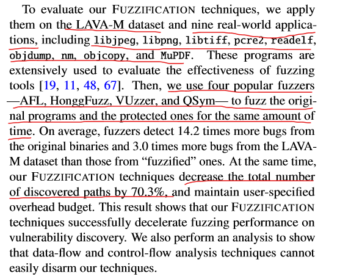

为了评估FUZZIFICATION技术，作者将它们**应用于LAVA-M数据集和九个实际应用程序**，包括libjpeg，libpng，libtiff，pcre2，readelf，objdump，nm，objcopy和MuPDF。然后，作者**使用四个流行的fuzzer**（AFL，HonggFuzz，VUzzer和QSym）在相同的时间内测试原始程序和受保护程序。


#### [LAVA-M介绍](https://www.cnblogs.com/wayne-tao/p/12813355.html)

>LAVA来自于论文《LAVA: Large-scale Automated Vulnerability Addition》发表在了2016年的S&P上，是由Brendan Dolan-Gavitt等人提出的用于在程序中插入bug的技术方法。通过LAVA在uniq、who、md5sum、base64四个程序上进行bug插入而形成的测试集即为LAVA-M。LAVA-M被广泛应用于fuzz领域的工具效果评估，我们所熟知的Angora、RedQueen、T-Fuzz、VUzzer等工具都使用了LAVA-M进行测试评估。


## Fuzzing Techniques


这里引用‘A systematic review of fuzzing techniques’文中的fuzz的框架图对现代fuzz结构进行简要说明。

Fuzzing的效率提升一般有两种方式：1. 每次执行速度更快；2. 需要更少的执行次数。


通常来讲,afl-fuzz需要对待fuzz程序**重编译,从而对其进行插桩**,这就要求拥有待fuzz程序的**完整源代码**。而afl-dyninst提供了一种**静态无源码插桩**的手段使得可以对无源码二进制程序插桩。

提高模糊测试效率的一种直接方法是使每次执行速度更快。当前的研究重点在于几种快速执行技术，包括：1. 定制的系统和硬件以加速fuzz计算执行；2. 并行fuzzing以大规模摊销绝对执行时间。


### coverage-guidance


Coverage-guided fuzzer为每次fuzzing执行收集代码覆盖率，并优先对触发新覆盖率的输入进行fuzz。大多数流行的fuzzer都以code coverage为指导，例如AFL，HonggFuzz和LibFuzzer，但是覆盖率表示和覆盖率收集的方法不同。

**Coverage representation**。大多数fuzzer都采用基本块（basic blocks）或分支来（branches）表示代码覆盖率。例如，HonggFuzz和VUzzer使用基本块覆盖率，而AFL则考虑分支覆盖率。 Angora 将分支覆盖范围与调用堆栈结合在一起，以进一步提高覆盖范围的准确性。但更细粒度的覆盖范围会给每次执行带来更高的开销，并且会损害模糊测试的效率。

**Coverage collection**。Fuzzer通常维护自己的数据结构来存储覆盖率信息。例如，AFL和HonggFuzz使用固定大小的数组，而VUzzer使用Python中的Set数据结构存储其覆盖范围。但是，结构的大小是精度和性能之间的折衷：太小的内存无法捕获每个覆盖范围的变化，而太大的内存会带来很大的开销。例如，如果位图大小从64KB更改为1MB，则AFL的性能会降低30％。


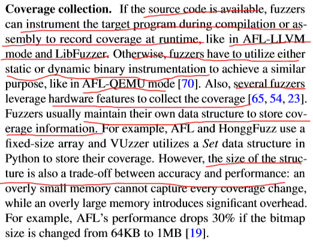

AFL同时支持两种Fuzz模式：

1. 有源码模式
2. 无源码模式（afl-qemu）

有源码的方式依赖于对源码的重新编译，从而进行插桩，通过类似 `afl-gcc -fno-stack-protector -z execstack vuln1.c -o vuln1`的命令（`-fno-stack-protector` 该选项会禁止`stack canary`保护
`-z execstack` 允许堆栈可执行），对代码重新编译，就可以使用如下命令进行fuzz测试了。

```bash
afl-fuzz -i ./testcases/ -o ./results/ ./vuln1
1
```

**AFL的无源码模式的fuzz依赖于qemu虚拟化**。使用apt方式安装的afl没有afl-qemu-trace(不支持使用QEMU模式)，所以我们需要下载afl的源码自己编译。

​	插桩是为了收集fuzz的过程信息。


### Fuzzing with Hybrid Approaches


利用污点分析去找到哪些输入字节是能引发new branch的关键字节；符号执行去反推什么样的输入能达到条件效果。

首先，fuzzer不区分具有不同类型（例如，magic number, length specifier）的输入字节，因此可能浪费时间来对不影响任何控制流的次要字节进行突变。 污点分析帮助查找哪些输入字节用于确定分支条件。通过关注这些字节的突变，fuzzer可以快速找到新的执行路径。 其次，模糊测试器无法轻松解决复杂的条件(e.g., 与Magic value或校验和进行比较)。 利用符号执行可以解决这个问题，但产生了高昂的开销。


## Fuzzification problem

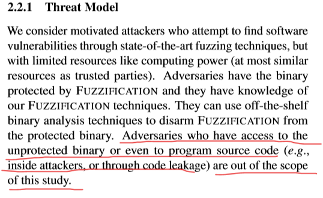

若攻击者能拿到源码，那就可以自己编译了。


packing/obfuscation比如加壳和混淆，会拖慢程序执行！！

bug injection故意注入不可利用的bugs让fuzzer记录这些无用bug，增加fuzz开销。但也会增加运行时开销，并且有可能会影响最终用户。

emulator bug触发插桩工具中的bug可以干扰fuzzing，专门fuzzer深入理解 generic


### design overview

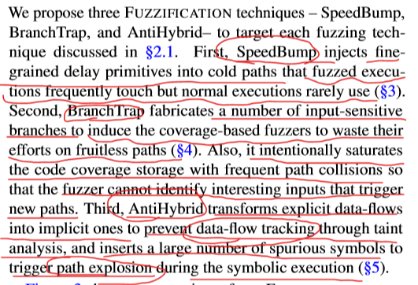

fine-grained delay primitives 细粒度的延迟基元

作者提出了三种FUZZIFICATION技术（SpeedBump，BranchTrap和AntiHybrid）来针对第2.1节中讨论的每种技术。

1. **SpeedBump**将细粒度的延迟原语（delay primitives）注入cold path中（fuzz会频繁执行这些path的但普通执行很少使用）。
2. **BranchTrap**构造了许多对输入敏感的分支，以诱使coverage-based fuzzer将其精力浪费在毫无结果的路径上。同样，它有意地使代码覆盖区存储充满频繁的路径冲突，从而使fuzzer无法识别触发新路径的有趣输入。
3. **AntiHybrid**将显式数据流转换为隐式数据流，以防止通过污点分析进行数据流跟踪，并插入大量伪造符号以在符号执行过程中触发路径爆炸。


加固流程：


需要源码

输入：**程序源代码、一组常用测试用例以及开销预算**，输出：**FUZZIFICATION技术保护的二进制文件**。大致步骤如下：

1. 编译生成正常的二进制文件，运行测试用例收集基本块频率，找到正常执行很少使用的基本块。
2. 根据配置文件将三种FUZZIFICATION技术应用于该程序并生成临时的受保护二进制文件。
3. 用正常测试用例再次测临时二进制文件的开销。如果开销超出预算，则返回到步骤2，以减少程序的slowdown。如果开销远低于预算，我们会相应增加开销。
4. 开销极限逼近预算，将生成受保护的二进制文件。


## SpeedBump


**依据**：通过经验观察，发现fuzz经常落在冷路径上（正常执行很少的路径）。 利用这个特性正好符合我们的要求。  在冷路径加delay，那么fuzz就会slow down，但是不怎么影响正常执行。

**方法**：首先从测试用例中确定cold path，然后将延迟注入到最少执行的代码路径。工具自动确定注入延迟的路径数量以及每个延迟大小，使正常执行过程中受保护的二进制文件产生的开销在用户定义的预算内。

- **Basic block frequency profiling.** FUZZIFICATION生成一个基本的块频率曲线，以识别冷路径。
- **Configurable delay injection.** 重复操作，确定要注入延迟的代码块及每个延迟大小，逼近开销。


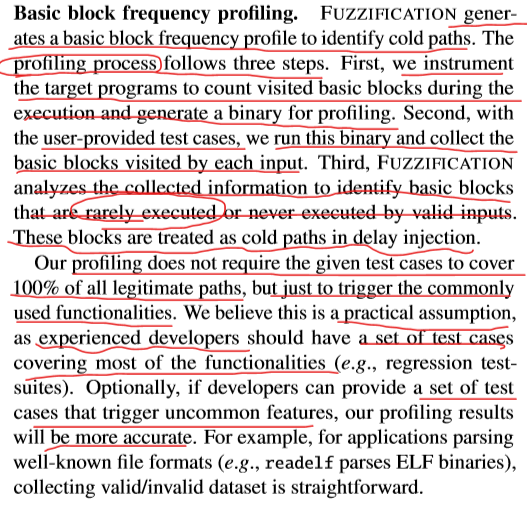

根据用户提供的样例去识别冷路径。


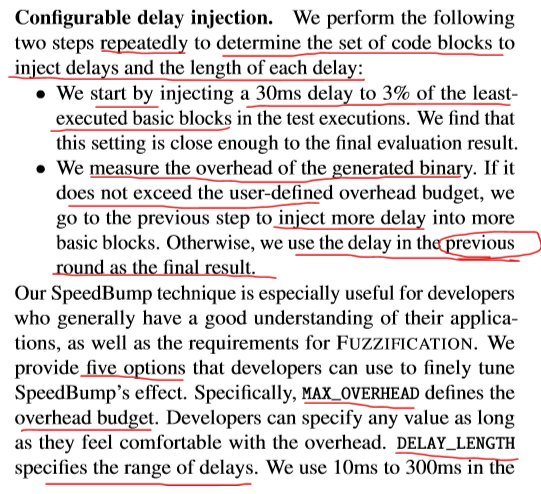


以指定的overhead为标准，做速度和安全之间的权衡。

​	我们的目标是向冷路径（很少执行的）中注入，这里的选项只是冷路径中的一小部分（特殊情形）


### Analysis-resistant Delay Primitives


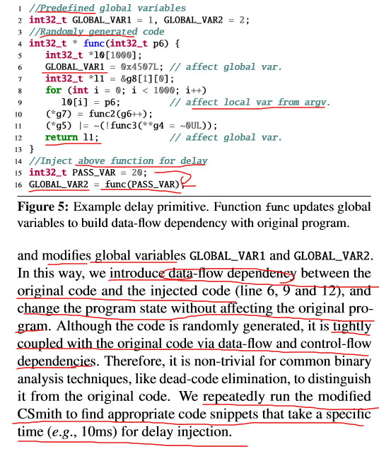

样例中，两个全局变量和局部变量都是注入的，加入了对源程序函数的一些不影响原状态的修改。     使得注入的代码和原代码融合，使得难以区别。        要明白，这里的注入delay，是往冷路径中添加分支的！！  所以

​	这样使得dead-code elimination失效。


#### dead-code elimination死码删除

>死码消除（Dead code elimination）是一种编译器原理中**编译最优化技术**，它的用途是**移除对程序运行结果没有任何影响的代码**。
>
>移除这类的代码有两种优点，不但可以减少程序的大小，还可以避免程序在运行中进行不相关的运算行为，减少它运行的时间。不会被运行到的代码（unreachable code）以及只会影响到无关程序运行结果的[变量](https://baike.baidu.com/item/变量/3956968)（Dead Variables），都是死码（Dead code）的范畴。


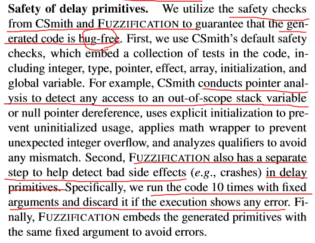

同时也要保证注入的delay代码是无bug的！！

**Safety of delay primitives.** 作者利用CSmith和FUZZIFICATION的安全检查来确保生成的代码没有错误。


#### 什么是 Csmith

>Csmith 是一个可以随机产生有效 C 程序的软件，它可通过随机测试（也称为**模糊** 测试）帮助发现编译器中的错误。在给定实现 C 标准的多个 C 编译器情况，我们通常可以通过运行多种不同版本编译器并比较它们的输出来判定是否产生了编译器的 bug。目前 Csmith 已经发现了超过 400 个编译器 bug，包括在 GCC 和 LLVM 上的。Csmith 主页见 [Csmith](https://link.ld246.com/forward?goto=https%3A%2F%2Fembed.cs.utah.edu%2Fcsmith%2F).
>


错误处理代码而产生的crash是没什么用的，因为已经被assert了，所以最近的fuzz都开始剔除这些block。     所以我们anti-fuzz，也可以考虑不对这些block进行处理，提高效率。

**Fuzzers aware of error-handling blocks.** VUzzer和T-Fuzz等fuzzer，通过概要分析来识别错误处理基本块，并将它们从代码覆盖率计算中排除，以避免重复执行。该技术使用类似的配置步骤来识别冷路径，可能会影响SpeedBump技术的有效性。但SpeedBump的冷路径不仅包括错误处理基本块，而且还包括很少执行的功能块。**FUZZIFICATION将集中于检测很少执行的功能块**，以最大程度地发挥其作用。


## BranchTrap


主要就是迷惑coverage-based fuzzer去掉进我们设计的trap中，让fuzzer误以为这里有new path


### Fabricating Fake Paths on User Input


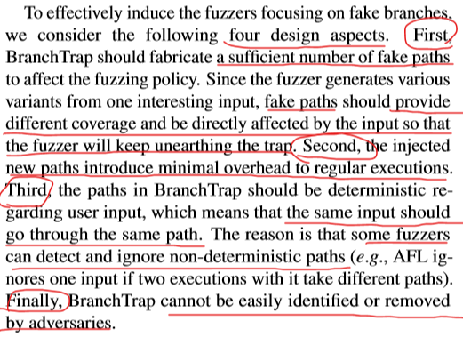

如果路径是不确定的，那么一些fuzzer会主动放弃这些路径，因为会影响fuzzing policy。不如在其他地方去fuzz，效率更高。


使用类似ROP的code-reuse方法，来实现robust BranchTrap


#### BranchTrap with CFG Distortion(Control Flow Graph)


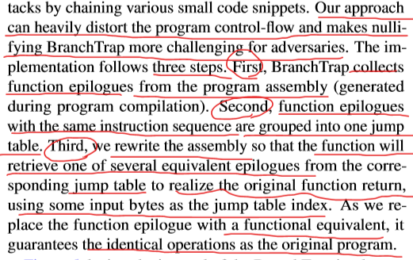


即重构所有函数。相同的**gadget地址**放到同一个table中。 这样fuzz会认为跳转到不同item是不同路径，但是实际运行，不管输入是什么，都是跳转到相同的gadget内容。


为了防止array索引溢出，会进行取模。


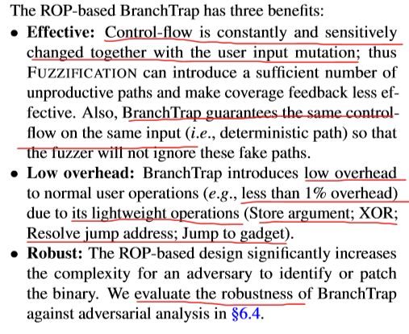


### saturating fuzzing state

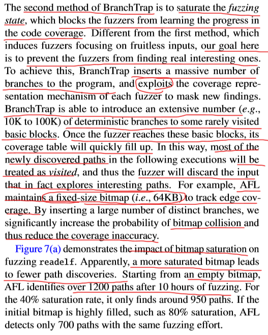

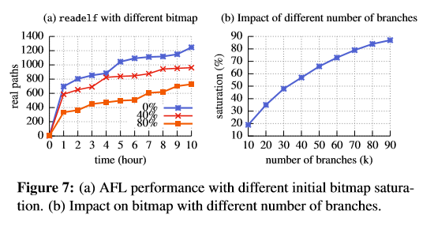

就是插入很多branch，使bitmap填满，这样fuzzer就会路径冲突，认为新路径已经访问过。


>afl采用了一个bitmap表记录被测程序的边覆盖率情况。这个bitmap表被设定为固定大小64k，是为了能够放入计算机的cache中，从而提升性能。然而对于大型程序来说，程序规模会非常大，导致程序边的数量非常多，远远大于64k。因此，对于64k的bitmap来说，这些大程序测试会经常出现**边冲突**的情况，即**出现多个边的信息被存放在bitmap中的同一个位置**。边冲突会导致afl错过发现新路径的机会，从而降低测试效率。
>
>http://www.xjishu.com/zhuanli/55/202010117203.html


### design factors


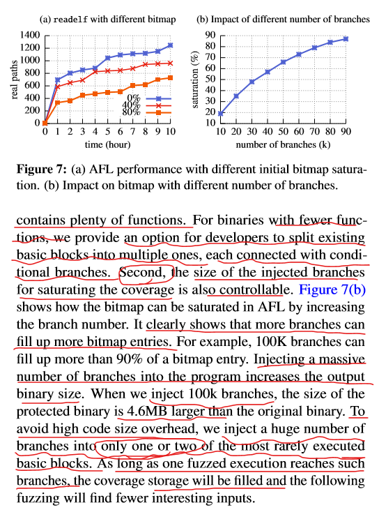

参数都是可以调整的。

saturation只会把branches插入到一两个最少访问的路径，这样对正常执行影响最小。

​	

## AntiHybrid


### hybrid的缺陷

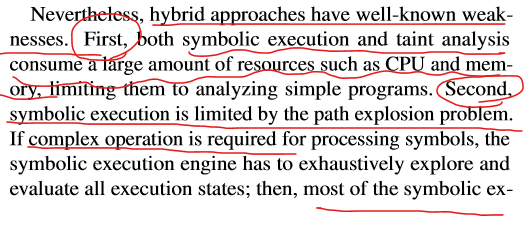


符号执行和污点分析都很消耗资源。

​	并且符号执行在遇到路径爆炸问题（即路径过多）时，复杂操作会让其崩溃。

​	污点分析对于不明确的数据流依赖关系不好处理。

http://www.doc88.com/p-80559457613814.html


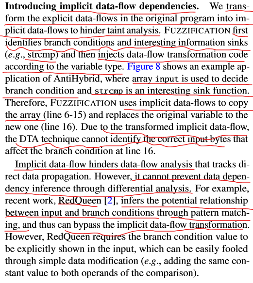


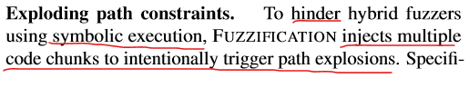

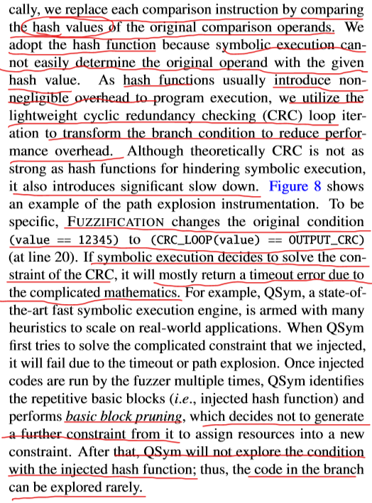

我们用hash来比较，取代原比较操作数。这样如果比较的是常数，那么符号执行就很难解。   为了减少overhead，hash替换成CRC        利用单向性


>CRC即循环冗余校验码（Cyclic Redundancy Check）：数据通信领域中最常用的一种差错校验码，其信息字段和校验字段长度可以任意指定，但要求通信双方定义的CRC标准一致。
>
>CRC校验的具体做法就是
>
>（1）选定一个标准除数（K位二进制数据串）
>
>（2）在要发送的数据（m位）后面加上K-1位0，然后将这个新数（M+K-1位）以模2除法的方式除以上面这个标准除数，所得到的余数也就是该数据的CRC校验码（注：余数必须比除数少且只少一位，不够就补0）
>
>（3）将这个校验码附在原m位数据后面，构成新的M+K-1位数据，发送给接收端。
>
>（4）接收端将接收到的数据除以标准除数，如果余数为0则认为数据正确。
>
>
>https://www.jianshu.com/p/2551ea7dbb14


### 崩溃去重

崩溃去重是fuzzing工具里很重要的问题之一。很多naive的解决方式都会有这样的问题：如果这个错误发生在一个普通的库函数中(如say, strcmp, strcpy)，只关注出错地址(faulting address)的话，那么可能导致一些完全不相关的问题被分在一类(clustered together)（即使出错地址相同）。如果错误发生在一些不同的、可能递归的代码路径中，那么校验和(checksumming)调用栈回溯(call stack backtraces)时可能导致crash count inflation。

afl-fuzz的解决方案认为满足以下两个条件，那么这个crash就是唯一的(unique)：

-这个crash的路径包括一个之前crash从未见到过的tuple。

-这个crash的路径不包含一个总(always)在之前crash中出现的tuple。

这种方式一开始容易受到count inflation的影响，但实验表明其有很强的自我限制效果。和执行路径分析一样，这种崩溃去重的方式是afl-fuzz的基石(cornerstone)。

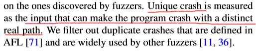


unique crash就是路径唯一的crash。不然多个路径都能引发这个crash，比如递归，那么栈回溯就会爆炸，不易分析。

##### Crash去重方法

（1）Ground Truth：找到的bug数目

 修补对应bug，看其他输入还能否触发crash，以确保唯一性

（2）AFL Coverage Profile

 若边覆盖（路径）唯一，就判定该crash“unique”

（3）Stack hashes

 根据N层递归调用来区别漏洞。N：3-5，可快速比对漏洞


## Discussion and Future work

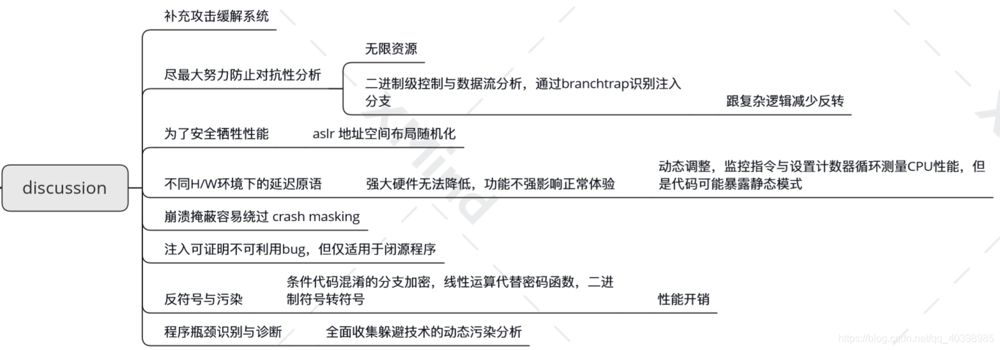


这里做的防护只是以现有的技术工具，难以识别pattern并patch。而手工patch依旧是有可能的，因为人可以自己找到规律去patch，但是工作量极大，如10w个分支，所以几乎不可能。


